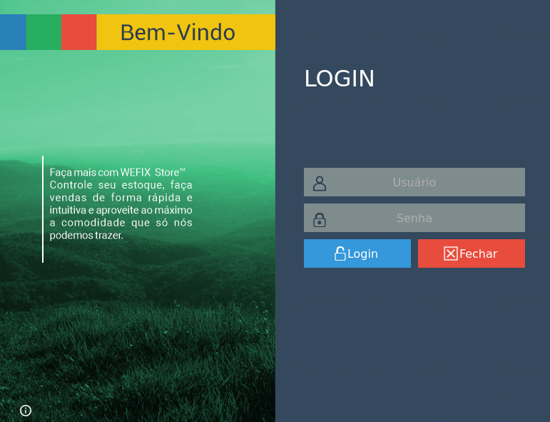
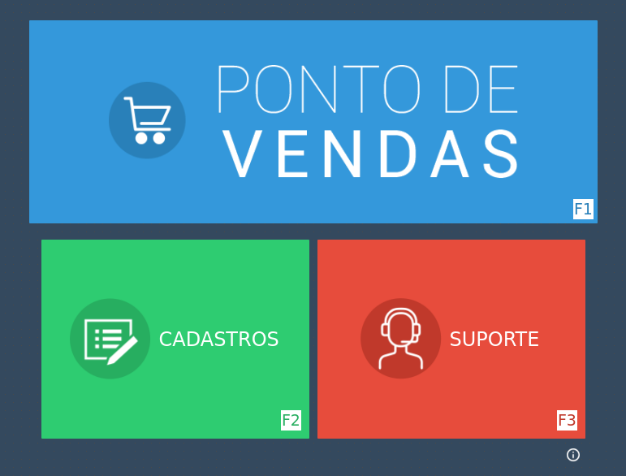
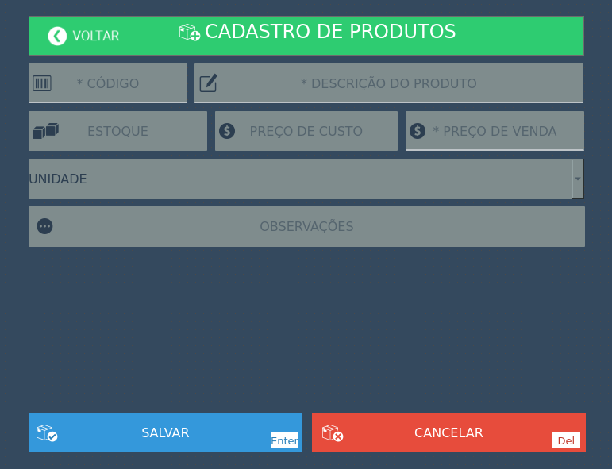
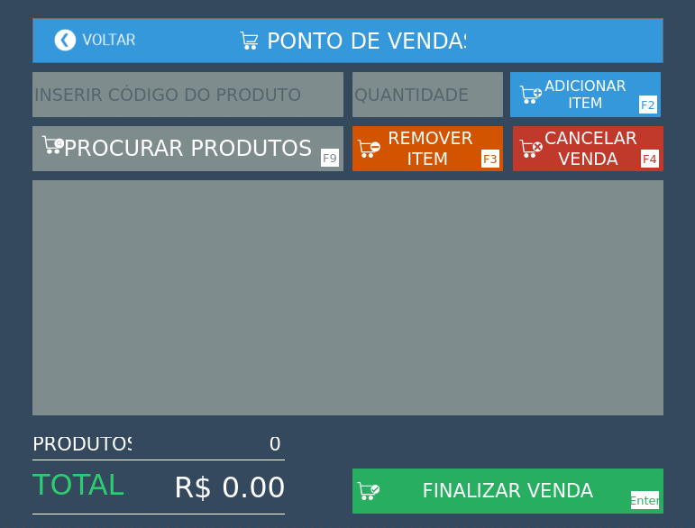

# Product and Sales CRUD Application

## Description 🇬🇧🇧🇷 (Descrição)

This is a CRUD (Create, Read, Update, Delete) application built using Qt and SQLite. It allows users to manage products and sales information.

Este é um aplicativo CRUD (Create, Read, Update, Delete) construído usando Qt e SQLite. Ele permite que os usuários gerenciem informações de produtos e vendas.

## Features 🛠️ (Recursos)

- Create, read, update, and delete products
- Create, read, update, and delete sales
- View list of products and sales
- Search functionality for products and sales

- Criar, ler, atualizar e excluir produtos
- Criar, ler, atualizar e excluir vendas
- Visualizar lista de produtos e vendas
- Funcionalidade de pesquisa para produtos.

## Screenshots 🖼️

#### Login

#### Main Screen / Tela Principal

#### Products Screen / Tela de Produtos

#### Sales Screen / Tela de Vendas

